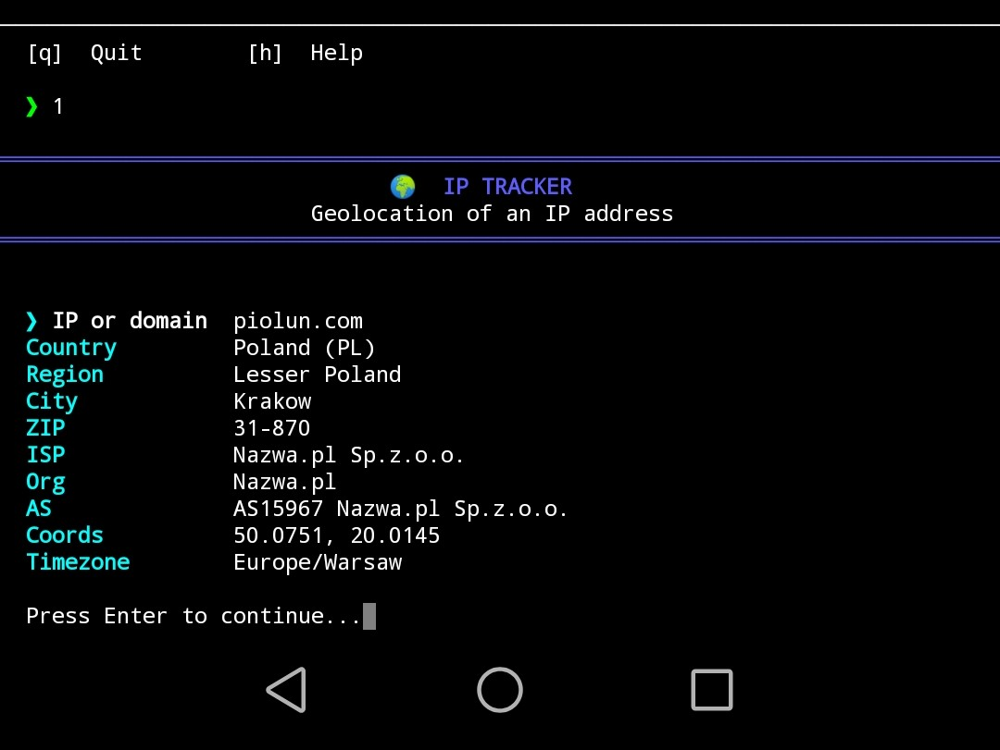

# KOOLTI-TOOL v8.2.1


A terminal-based network & security toolkit with **114 modules**, a plugin system, auto-update, and smart UX features.

```
  ██╗  ██╗ ██████╗  ██████╗ ██╗  ████████╗██╗
  ██║ ██╔╝██╔═══██╗██╔═══██╗██║  ╚══██╔══╝██║
  █████╔╝ ██║   ██║██║   ██║██║     ██║   ██║
  ██╔═██╗ ██║   ██║██║   ██║██║     ██║   ██║
  ██║  ██╗╚██████╔╝╚██████╔╝███████╗██║   ██║
  ╚═╝  ╚═╝ ╚═════╝  ╚═════╝ ╚══════╝╚═╝   ╚═╝
```

## Requirements

```bash
pip install requests psutil rich
```

## Installation

```bash
git clone https://github.com/piolunson/koolti-tool.git
cd koolti-tool
pip install -r requirements.txt
python koolti_tool.py
```

Optional GPU support for Hash Cracker (module 64):
```bash
# hashcat — recommended, ~15 billion H/s
winget install hashcat        # Windows
sudo apt install hashcat      # Linux

# CuPy — Python CUDA kernel (CUDA 12.x only, MD5)
pip install cupy-cuda12x
```

## Usage

```bash
python koolti_tool.py
```

| Shortcut | Action |
|----------|--------|
| `[number]` | Run a module |
| `/` or `search` | Search modules by name or keyword |
| `fav` | Open favourites |
| `u` | Check for updates |
| `h` | Help |
| `q` | Quit |
| `↑ ↓` | Navigate command history |

## Preview



## Modules

### 🌐 NETWORK (1–30)
| # | Module | Description |
|---|--------|-------------|
| 1 | IP Tracker | Geolocation of IP address |
| 2 | DNS Lookup | Resolve domain names |
| 3 | Port Scanner | Scan open ports |
| 4 | MAC Lookup | Identify NIC manufacturer |
| 5 | Local Network Info | Network interfaces |
| 6 | Ping Tool | Test host reachability |
| 7 | Subdomain Finder | DNS subdomain discovery |
| 8 | Traceroute | Trace packet route |
| 9 | Reverse IP Lookup | Hostname from IP |
| 10 | GeoIP Info | Detailed geographic info |
| 11 | Network Interface Stats | Bytes sent/received per interface |
| 12 | ARP Scanner | Discover live hosts on LAN |
| 13 | Banner Grabber | Read raw service banners |
| 14 | HTTP Method Tester | Test which HTTP methods are allowed |
| 15 | SMTP Checker | Test SMTP connectivity + EHLO |
| 16 | FTP Checker | Test FTP + anonymous login detection |
| 17 | SSH Checker | SSH port + banner + version |
| 18 | SNMP Checker | SNMP community string bruteforce |
| 19 | BGP ASN Lookup | Autonomous System info via bgpview.io |
| 20 | IP Range Scanner | Ping sweep a CIDR range |
| 21 | Network Speed Test | Download speed via Cloudflare |
| 22 | WiFi SSID Scanner | List nearby WiFi networks |
| 23 | mDNS Discovery | Discover local network services |
| 24 | DNS Zone Transfer | Attempt AXFR zone transfer |
| 25 | Open Redirect Tester | Test for open redirect vulnerabilities |
| 26 | CORS Policy Checker | Analyze CORS headers and misconfigs |
| 27 | CDN Detector | Detect CDN provider from headers |
| 28 | IPv6 Checker | IPv6 connectivity and address info |
| 29 | Port Knock Detector | Scan for port-knock protected ranges |
| 30 | Shodan IP Lookup | Full Shodan API query (requires API key) |

### 🕸 WEB / OSINT (31–62 + 105–110)
| # | Module | Description |
|---|--------|-------------|
| 31 | Admin Finder | Discover admin and login panels |
| 32 | CMS Detector | Detect CMS platform |
| 33 | WAF Detector | Detect Web Application Firewall |
| 34 | HTTP Header Inspector | Analyze HTTP + security headers |
| 35 | Link Extractor | Extract all links from a page |
| 36 | WHOIS Lookup | Domain registration info via RDAP |
| 37 | Robots.txt Checker | Analyze robots.txt + sitemap.xml |
| 38 | URL Scanner | Redirect chain + SSL + server info |
| 39 | Email Validator | Format, domain, and disposable check |
| 40 | Wayback Machine | Check archived versions on archive.org |
| 41 | Tech Stack Detector | Detect JS frameworks, CDNs, analytics |
| 42 | Broken Link Checker | Find dead links on a page |
| 43 | SSL Certificate Info | TLS cert details + expiry countdown |
| 44 | HTTP Status Bulk Checker | Check status of multiple URLs at once |
| 45 | Google Dork Generator | Generate targeted Google dork queries |
| 46 | HTTP Parameter Fuzzer | Fuzz URL parameters for unexpected responses |
| 47 | JS File Extractor | Find external + inline JS on a page |
| 48 | Form Extractor | Extract forms, inputs, and hidden fields |
| 49 | Cookie Inspector | Analyze cookies and Secure/HttpOnly flags |
| 50 | IP Reputation Check | Check if IP is proxy/hosting/flagged |
| 51 | Path Traversal Tester | Test for directory traversal vulnerabilities |
| 52 | SQL Error Detector | Detect SQL error messages in responses |
| 53 | Subdomain Takeover Check | Check subdomains for takeover risk |
| 54 | TLS Version Checker | Check supported TLS 1.0–1.3 versions |
| 55 | WhatWeb Lite | Quick tech fingerprint from headers + HTML |
| 56 | Latency Map | Ping 6 global endpoints and compare RTT |
| 57 | Certificate Transparency | Find all SSL certs via crt.sh |
| 58 | HTTP Cache Inspector | Analyze Cache-Control and caching headers |
| 59 | Security Headers Score | Grade site headers A+/A/B/C/D/F |
| 60 | DNS History Lookup | Historical DNS records via HackerTarget |
| 61 | Multi-Port Banner Scan | Grab banners from 13 common ports at once |
| 62 | Network Topology | Map route hops via TTL probing |
| 105 | XSS Scanner | Test for reflected XSS vulnerabilities |
| 106 | Directory Bruteforcer | Discover hidden paths on a web server |
| 107 | API Endpoint Fuzzer | Discover common REST/GraphQL endpoints |
| 108 | Email Harvester | Extract email addresses from a page |
| 109 | HTTP Smuggling Detector | Detect CL.TE and TE.CL anomalies |

### 🔐 CRYPTO (63–75 + 110–114)
| # | Module | Description |
|---|--------|-------------|
| 63 | Hash Generator | MD5 / SHA-1/256/384/512 / SHA3 / NTLM |
| 64 | Hash Cracker | CPU multiprocessing + GPU (hashcat / CuPy) |
| 65 | Base64 Tool | Encode and decode Base64 |
| 66 | Caesar Cipher | Encrypt / decrypt / brute force all 25 shifts |
| 67 | Password Strength | Score password with tips (1–8 pts) |
| 68 | Wordlist Generator | Generate password variants from a base word |
| 69 | ROT13 Cipher | Symmetric ROT13 encoding |
| 70 | XOR Cipher | XOR encrypt with a key |
| 71 | Morse Code | Encode and decode Morse code |
| 72 | Binary Converter | Text ↔ binary |
| 73 | Hex Converter | Text ↔ hexadecimal |
| 74 | URL Encoder/Decoder | Percent-encode and decode URLs |
| 75 | JWT Decoder | Decode JWT header + payload |
| 110 | Vigenère Cipher | Polyalphabetic substitution cipher |
| 111 | Atbash Cipher | Mirror alphabet (A↔Z, B↔Y...) |
| 112 | Hash Identifier | Detect hash type from length and format |
| 113 | Advanced Password Gen | 4 presets + custom rules + save to file |
| 114 | Encoding Detector | Auto-detect Base64/Hex/URL/ROT13/Binary/Caesar |

### 💻 SYSTEM (76–85)
| # | Module | Description |
|---|--------|-------------|
| 76 | System Info | OS, CPU, RAM, disk usage bars |
| 77 | File Analyzer | Metadata + MD5/SHA-256 of any file |
| 78 | WiFi Passwords | Read saved WiFi passwords (Windows only) |
| 79 | Process Viewer | Top 20 processes by RAM usage |
| 80 | Disk Usage | All partitions with usage bars |
| 81 | Environment Variables | List + filter system env vars |
| 82 | Open Connections | Active TCP/UDP network connections |
| 83 | File Hash Verifier | Verify file integrity against known hash |
| 84 | Directory Scanner | List directory contents with sizes |
| 85 | Log File Reader | Read and keyword-filter log files |

### 🛠 UTILITIES (86–104)
| # | Module | Description |
|---|--------|-------------|
| 86 | IP Calculator (CIDR) | Network, broadcast, hosts, type |
| 87 | Random Password Generator | Secure random passwords |
| 88 | UUID Generator | UUID v1 or v4 |
| 89 | Text Case Converter | UPPER / lower / snake_case / CamelCase |
| 90 | Lorem Ipsum Generator | Configurable placeholder text |
| 91 | JSON Formatter | Format, validate, and syntax-highlight JSON |
| 92 | Unix Timestamp Converter | Timestamp ↔ date |
| 93 | Color Code Converter | HEX ↔ RGB + terminal preview |
| 94 | String Analyzer | Char frequency, word count, top letters |
| 95 | Number Base Converter | DEC / BIN / OCT / HEX / Unicode |
| 96 | Regex Tester | Test regex with match highlighting |
| 97 | ASCII Art Generator | Text → block ASCII art |
| 98 | History Viewer | Browse saved session history |
| 99 | History Clear | Delete all history files |
| 100 | Network Topology (ext) | Extended TTL route mapping |
| 101 | Plugin Manager | View loaded plugins |
| 102 | Check for Update | Manually check for newer version |
| 103 | Favourites | Save and run your top modules |
| 104 | Module Search | Find modules by name or keyword |

## Plugin System

Drop a `.py` file into `~/kooltitool/plugins/` and restart — your plugin
loads automatically as slot `200`, `201`, `202`...

```python
def run():
    print("Hello from my plugin!")

def register():
    return {
        "name":        "My Plugin",
        "description": "Does something cool",
        "category":    "NET",
        "author":      "yourname",
        "version":     "1.0.0",
        "run":         run,
    }
```

See `example_plugin.py` for a full working example.  
Want your plugin in the official release? → piolunson@proton.me

## Auto-Update

Checks for updates automatically on every startup.  
Type `u` anytime to check manually.

```
  ██ UPDATE AVAILABLE  v8.2.1 → v8.3.0
  https://github.com/piolunson/koolti-tool/releases
```

## History

Results saved to `~/kooltitool/history/YYYY-MM-DD/` as JSON files.  
Password modules **(64, 67, 68, 87)** excluded.  
Browse with `[98]`, clear with `[99]`.

## Repository Structure

```
koolti-tool/
├── koolti_tool.py
├── version.txt
├── example_plugin.py
├── requirements.txt
├── README.md
├── MEDIA.md
├── LICENSE
├── SECURITY.md
├── CONTRIBUTING.md
├── .gitignore
└── img/
    └── ss1.jpg
```

## Media & YouTube

Want to make a video about koolti-tool? You are welcome to!  
Please read **[MEDIA.md](MEDIA.md)** for the full policy.

**Short version:**
- ✅ Free YouTube videos, tutorials, streams — allowed
- ✅ Mention in blogs, articles, podcasts — allowed
- ❌ Paid courses using koolti-tool as core content — contact first
- ❌ Promoting illegal use — never allowed
- ❌ Removing author credit — never allowed

Required in description: link to this repo + credit to piolunson.

## Changelog

### v8.2.1
- Version bump and stability fixes
- Updated MEDIA.md — YouTube and content creator policy

### v8.2.0
- Added **Module Search** `[104]` — find modules by name or keyword, `/` shortcut
- Added **Favourites** `[103]` — save up to 5 favourite modules, `fav` shortcut
- Added **Command History** — arrow keys ↑/↓ navigate previous commands
- Added keyboard shortcuts in prompt: `/`, `fav`, `u`, `h`
- Added 5 new WEB modules: XSS Scanner `[105]`, Directory Bruteforcer `[106]`, API Endpoint Fuzzer `[107]`, Email Harvester `[108]`, HTTP Smuggling Detector `[109]`
- Added 5 new CRYPTO modules: Vigenère Cipher `[110]`, Atbash Cipher `[111]`, Hash Identifier `[112]`, Advanced Password Generator `[113]`, Encoding Detector `[114]`
- Total: **114 modules**

### v8.1.0
- Added **Plugin System** — extend with `.py` files in `~/kooltitool/plugins/`
- Added **Auto-Update** — checks GitHub on every startup, `u` shortcut
- Added `[101]` Plugin Manager, `[102]` Check for Update
- Added `version.txt`, `example_plugin.py`, `SECURITY.md`, `requirements.txt`

### v8.0.0
- Added 20 new modules (46–62, 98–100)
- Automatic session history (`~/kooltitool/history/`)
- Full English rewrite

### v7.x
- 80 modules, GPU hash cracking, TUI rewrite

### v6.0.0
- 60 modules, ASCII logo, progress bars

### v5.0.0
- First major release — 25 modules

## Legal Notice

For **educational purposes** and **authorized testing only**.  
Use only on systems you own or have explicit written permission to test.

## License

Custom non-commercial license — see [LICENSE](LICENSE).

- ✅ Free non-commercial use and distribution
- ❌ No selling or commercial use without permission
- ❌ No modification without contacting the author first

📧 [piolunson@proton.me](mailto:piolunson@proton.me)

